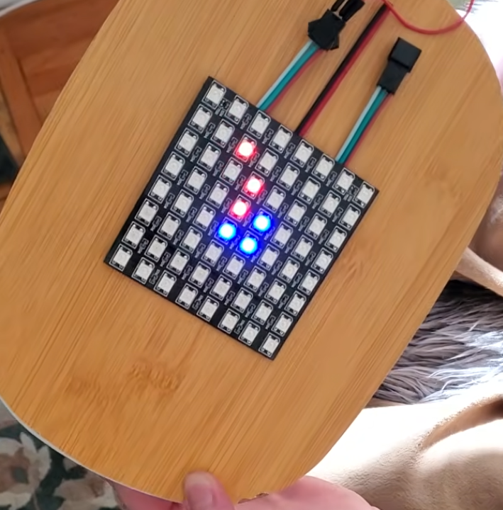
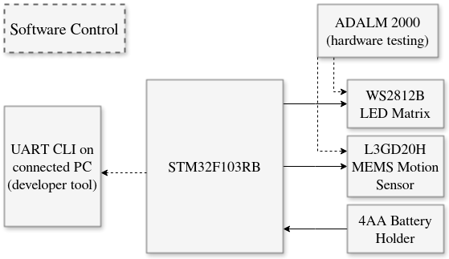

# MCU Level-Detector

**1. Project Summary**

This project is to create a device to be used as a digital level-indicator. It combines the orientation reading from an IMU accelerometer with the output of an LED matrix to display an easy-to-understand indication of how the device needs to be rotated to achieve a level orientation. It can be used in place of a bubble-level with the added benefit of being able to display the orientation relative to level in two dimensions (a plane) instead of one dimension.

Physically, the device is a small box containing the MCU, power supply, and motion sensor with an exterior LED matrix on the top face.

---

[View the demo on Youtube.](https://www.youtube.com/shorts/PYWkurkAO90)

---

**1.1 Build Instructions**

Follow these steps to build and flash the program to the STM32F103RB board after wiring the components together:

1. Open the project in STM32CubeIDE
    1. The software makes extensive use of the HAL library, and is required to be built and flashed from STM32CubeIDE.
2. Under the "Project" tab, select "Build Project"
3. Under the "Run" tab, select "Run" to flash the program to the board.

**2. Project Design**

The device uses as few components and software libraries to achieve its purpose. Software libraries were created for each hardware component and Nucleo peripheral used, including:

1. I2C library for the IMU
2. Timer PWM-DMA library for the LED Matrix
3. Timer generic library
4. UART library for CLI connection

Each library is documented following the Doxygen protocol; a Doxyfile is included in the source code to generate the related Doxygen HTML page.

Additionally, the device uses a simple FreeRTOS configuration to manage scheduling the periodic task of fetching the IMU data, refreshing the CLI display, and refreshing the LED matrix display.

 **2.1 Usage**

 The device simply needs to be powered and it will begin to display orientation data on the LED matrix. A line of red pixels is drawn on the device's LED matrix which, if rotated towards, will guide the user towards orienting the device as level. 
 
 The center 4 pixels of the LED matrix are displayed as blue, excluding one LED displayed as red representing the "beginning" of the orienting line. When the device is near level such that the red line magnitude is only 1 pixel, the center LEDs will change to green, still excluding the single red LED. As the device is further adjusted towards level, the brightness of the green LEDs will increase. When the device is within the level threshold, it will only display the center 4 LEDs as green with no red LEDs.

**2.2 Hardware Components**

1. Nucleo STM32F103RB Development Board
2. LSM303DLHC MEMS motion sensor
3. WS2812B LED Matrix
4. 4AA Battery holder

**2.3 Peripheral Connection**

The MCU peripherals are connected to the hardware components as follows:

1. MCU power supply jumper is connected to E5V (external power supply)
2. MCU PB6 (I2C1_SCL): IMU SCL
3. MCU PB7 (I2C1_SDA): IMU SDA
4. MCU 3V3: IMU VIN
5. MCU GRD: IMU GRD
6. MCU PA6 (TIM3_CH1): WS2812B DIN
    1. Connected in-series with a 390ohm resistor
7. MCU 5V: WS2812B VIN
8. MCU GRD: WS2812B GRD

**2.4 Block Diagram**

**3. Software**

The software for the device includes a FreeRTOS with minimal tasks and libraries for each peripheral and hardware device used. The device makes heavy use of the HAL library functions included in the STM32CubeIDE which greatly simply the initialization and operation of the MCU peripherals and hardware. Peripherals used in the device are:

1. I2C1 (IMU)
2. TIM3 (LED Matrix)
3. TIM4 (FreeRTOS Timebase)
4. UART2 (CLI)

**3.1 FreeRTOS**

The program is driven by FreeRTOS, which is used to schedule two tasks:

1. Init - a high-priority task that calls all the initialization functions for the program, including initializing the accelerometer, LED matrix, and CLI.
    1. Additionally, it sets the LED matrix to display a blue color across every pixel to indicate a system reset before being overwritten by another write to the matrix. This acts as an indicator to the user if the device ever resets. If normal execution resumes, the data fetch and display cycle overwriting this restart-indicator results in a simple blue flash on the matrix before resuming normal operation.
    2. This task suspends itself indefinitely at the end of its execution since each system initialization function only needs to be called once.
2. LEDUpdate - a regular-priority task that periodically fetches the accelerometer data, refreshes the CLI, and updates the LED matrix.
    1. After finishing an execution loop, the task delays itself until 300ms have passed.

**3.2 I2C and LSM303DLHC**

This library is responsible for initializing and fetching accelerometer data from the IMU. It provides additional utility functions: 

1. `is_level()` - given accelerometer data to determine if the device is considered level within a specified threshold.
2. `is_near_level()` - given accelerometer data to determine how close to level the device is between outer and inner threshold levels. It returns a number from a range of results according to a specified number of steps (e.g. 0 to 9) to be processed by other hardware.

**3.3 PWM DMA and WS2812B**

This library is responsible for initializing the LED matrix and setting the matrix pixels according to various conditions. It utilizes a primary `uint16_t` data array `led_pwm_data` that contains the data for each pixel of the array, with an additional reset-signal prepended to the array. Each pixel takes in 24 bits, with 8 bits for each color (i.e. green, red, and blue). `led_pwm_data` is populated through the utility function `WS2812B_set_pixel_color()` called by various other functions.

Data is transmitted through the `WS2812B_update()` function which sends data using the WS2812B protocol. Data is sent through the TIM3 timer peripheral configured for pulse-width modulated direct memory access with the LED matrix. This is required because the WS2812B protocol characterizes data bits through different pulse-widths for each pixel datum.

The primary functionality of this library is executed through the `WS2812B_point()` function. This function updates the `led_pwm_data` array using the utility function `bresenham_line_serpentine()` that calculates which pixels should be enabled to draw a line between two points given to the function. Additionally, the point function also makes use of the I2C `is_level()` and `is_near_level()` alongside the `WS2812B_set_center_color()` function to update the center pixels according to the results of the I2C function calls. Finally, the point function also identifies if accelerometer data is outside a reasonable bound set in the I2C library and enables LEDs along the respective edge(s) of the matrix that correspond to the out-of-bounds data.

Through these functions, the LED matrix is updated to reflect one of four states:

1. The device is level and displays the center LEDs as bright green.
2. The device is near-level and displays the center LEDs as green with their brightness modulated according to how close to level the device is. Additionally, a single red pixel is displayed in one of the center LEDs that shows how the device should be rotated to achieve a level orientation.
3. The device is not level and displays the center LEDs as blue with a line of red pixels drawn indicating the how the device should be rotated to achieve a level orientation. The length of the line is extended to reflect how far away from level the device is oriented.
4. The device is very far from level and displays the full edge(s) of the LED matrix as red in the direction towards which it should be rotated.

**3.4 UART CLI**

The device displays a UART CLI through the USB connection. The CLI is populated by a live feed of the raw accelerometer data that gets updated with every data fetch from the LSM303DLHC. It also displays the date and commit hash of the the current build. Additionally, the CLI has the capacity to receive user input and execute commands, although currently the only commands implemented are the "clear" and "help" commands. This input feature is largely unneeded in its current capacity, although it can be easily extended to add additional commands.

**4. Testing**

_Note: when the device is at rest, the typical "max" reading of the raw data of all combined vectors is approximately 17000._

Below are the test cases used to assert proper operation of the device:

**4.1. Directly observe the IMU output signal while level**

- _Expectation_: IMU output should remain at level-appropriate values
- _Procedure_: Observe the IMU output through the CLI data feed while the device is level
- _Results_: IMU output remained at values of x ~= 0, y ~= 0, and z ~= 17000

**4.2 Directly observe the IMU output signal while rotating in a single axis of motion (pitch/yaw/roll)**

- _Expectation_: IMU output should increase/decrease for the appropriate axis of rotation only
- _Procedure_: Observe the IMU through the CLI data feed while rotating the device along a single axis
- _Results_: IMU output would decrease the magnitude of the z-data as it increased the magnitude of either the x-data or y-data as it was rotated in each respective axis

**4.3 Compare to physical bubble-level measurement at level orientation**

- _Expectation_: LED matrix output should match the bubble-level orientation
- _Procedure_: Place the device on a camera tripod shown to be level via an attached bubble-level
- _Results_: The LED matrix showed that the device was level, matching the bubble-level indicator

**4.4 Compare to physical bubble-level measurement on various non-level orientations**

- _Expectation_: LED matrix output should match the bubble-level orientation
- _Procedure_: Place the device on a camera tripod with an attached bubble-level and rotate to several different orientations
- _Results_: The LED matrix output would indicate the appropriate direction towards level as it was rotated, matching the bubble-level indicator

**4.5 Single-axis rotation from level position**

- _Expectation_: LED matrix output should indicate the opposite direction of motion
- _Procedure_: Hold the device at a level position and rotate along a single axis; repeat in other single-axis rotations
- _Results_: The LED matrix output matched the direction it should be rotated, with the length of the line growing to match the degree to which the device was rotated away from level in each direction

**4.6 Rapid rotation, returning to level**

- _Expectation_: The device should properly indicate level when returned to a level orientation
- _Procedure_: Rapidly tilt the device in various directions, then quickly return to a known-level orientation
- _Results_: The device displayed the level-indication when returned to a level orientation

**4.7 Maintaining a non-level orientation**

- _Expectation_: LED matrix output should remain fixed and not change
- _Procedure_: Hold the device in a non-level position for a brief period of time (10 - 30 seconds)
- _Results_: The LED matrix displayed the same output for the entire duration

**4.8 Rotation about yaw-axis**

- _Expectation_: LED Matrix output should remain fixed at level-indicating state
- _Procedure_: Begin with the device in a level orientation and rotate it about its yaw-axis
- _Results_: The device would switch between level and near-level states due to its sensitivity; the device never entered normal operating mode outside of the near-level state

**4.9 User Intuition**

- _Expectation_: A person who has not used the device before should be able to use it with only the instruction that it is a level-indicator
- _Procedure_: Hand the device to a user who has not seen it before and explain that it is a level-indicator
- _Results_: New user was able to orient the device to level with difficulty. They briefly explored rotating it in different orientations to observe how it behaved.